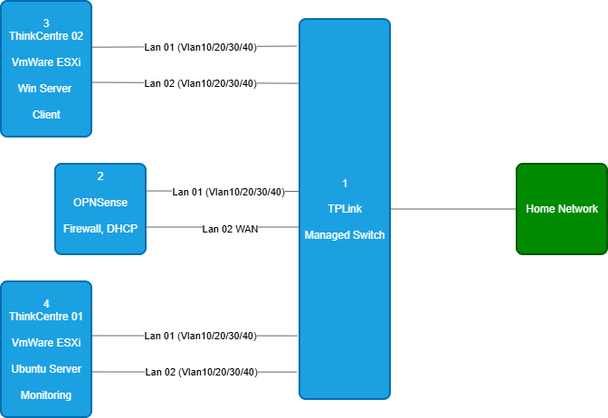
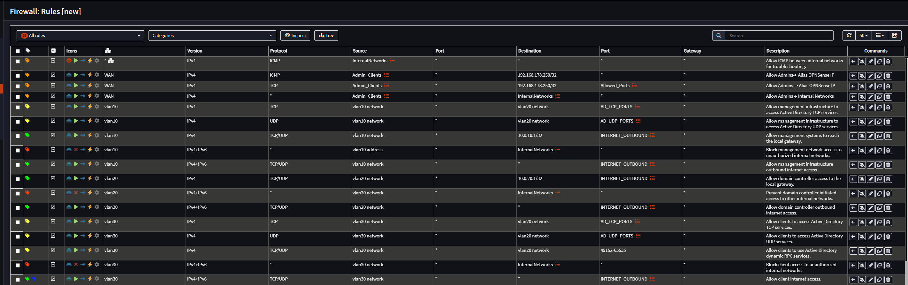
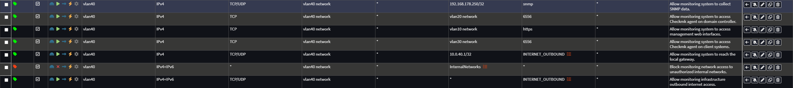

# 02. Networking & Security

## Overview

This section documents the network architecture, VLAN segmentation, firewall design, and security controls implemented within the HomeLab environment.

The network follows a segmented, least-privilege design with centralized routing and security enforcement through OPNsense.

---

*Table of Contents*

* [Physical Network Topology](#physical-network-topology)
* [Network Architecture](#network-architecture)
* [DHCP Services](#dhcp-services)
* [VLAN Overview](#vlan-overview)
* [VLAN Security Zones](#vlan-security-zones)
* [Firewall Access Matrix](#firewall-access-matrix)
* [Firewall Rule Implementation](#firewall-rule-implementation)
* [Security Benefits](#security-benefits)

---

# Physical Network Topology

<i>Figure: Physical network topology of the HomeLab environment</i>

---

# Network Architecture

The HomeLab uses a dedicated OPNsense firewall as the central security gateway.

Responsibilities include:

- Inter-VLAN Routing
- Firewall Policy Enforcement
- Network Segmentation
- Internet Access Control
- VPN Connectivity

All internal VLANs are transported via 802.1Q trunk links between the switch, firewall, and ESXi hosts.

---

# DHCP Services

DHCP services are provided by OPNsense and centrally managed for all VLANs.

Each network segment receives its own DHCP scope, gateway configuration, DNS settings, and domain suffix information.

| VLAN | DHCP Scope |
|----------|----------|
| VLAN 10 | 10.0.10.30 - 10.0.10.200 |
| VLAN 20 | 10.0.20.30 - 10.0.20.200 |
| VLAN 30 | 10.0.30.30 - 10.0.30.200 |
| VLAN 40 | 10.0.40.30 - 10.0.40.200 |

Critical infrastructure systems such as OPNsense, ESXi hosts, the Domain Controller, and the monitoring server use static IP addressing outside of the DHCP ranges.

---

# VLAN Overview

| VLAN | Name | Subnet | Purpose |
|----------|----------|----------|----------|
| VLAN 10 | Infrastructure | 10.0.10.0/24 | ESXi Management |
| VLAN 20 | Servers | 10.0.20.0/24 | Active Directory Services |
| VLAN 30 | Clients | 10.0.30.0/24 | Domain Joined Clients |
| VLAN 40 | Monitoring | 10.0.40.0/24 | Checkmk Monitoring |
| VLAN 999| Black Hole | N/A | Isolation of untagged and unauthorized network traffic |
---

# VLAN Security Zones

| VLAN | Role | Purpose |
|----------|----------|----------|
| VLAN 10 | Infrastructure | Dedicated management network for ESXi hosts and infrastructure administration |
| VLAN 20 | Servers | Centralized Windows infrastructure services including Active Directory and DNS |
| VLAN 30 | Clients | Domain-joined workstation network for end-user systems and policy testing |
| VLAN 40 | Monitoring | Isolated monitoring network for Checkmk, SNMP, and service availability checks |

---

# Firewall Access Matrix

The following table summarizes the permitted communication between VLANs.

| Source | Destination | Allowed Services |
|----------|----------|----------|
| VLAN10 | VLAN20 | Active Directory TCP Services |
| VLAN10 | VLAN20 | Active Directory UDP Services |
| VLAN10 | Local Gateway | DNS / Internet Access |
| VLAN20 | Local Gateway | DNS / Internet Access |
| VLAN30 | VLAN20 | Active Directory TCP Services |
| VLAN30 | VLAN20 | Active Directory UDP Services |
| VLAN30 | VLAN20 | Dynamic RPC (49152-65535) |
| VLAN30 | Internet | Internet Access |
| VLAN40 | OPNsense | SNMP |
| VLAN40 | VLAN20 | Checkmk Agent (TCP 6556) |
| VLAN40 | VLAN10 | HTTPS Management Access |
| VLAN40 | VLAN30 | Checkmk Agent (TCP 6556) |
| VLAN40 | Local Gateway | DNS / Internet Access |

All other inter-VLAN communication is denied.

---

# Firewall Aliases

To simplify firewall management and improve readability, firewall aliases are used throughout the OPNsense configuration.

## AD_TCP_PORTS

Examples include:

- LDAP
- LDAPS
- Kerberos
- SMB
- Global Catalog

## AD_UDP_PORTS

Examples include:

- DNS
- Kerberos
- NTP

## Dynamic RPC

`49152-65535`

Required for proper Active Directory communication.

This approach avoids overly permissive firewall rules while maintaining full AD functionality.

---

# Firewall Rule Implementation

### Core Infrastructure Rules

<i>Figure: Infrastructure, Active Directory and client firewall policies</i>

Key Highlights:

- Dedicated Active Directory port aliases
- Explicit AD TCP and UDP access control
- Dynamic RPC support
- Explicit deny rules between VLANs
- Controlled internet access

---

### Monitoring Rules

<i>Figure: Monitoring VLAN firewall policies</i>

Key Highlights:

- Dedicated monitoring network
- Restricted SNMP access
- Restricted Checkmk agent access
- HTTPS management monitoring
- Default-deny enforcement

---

# Security Benefits

This design provides:

- Reduced attack surface
- Controlled lateral movement
- Improved visibility
- Segmented infrastructure
- Centralized monitoring
- Enterprise-inspired network security

The environment demonstrates practical implementation of network segmentation, firewall management, monitoring, and Active Directory integration within a Windows-focused infrastructure environment.