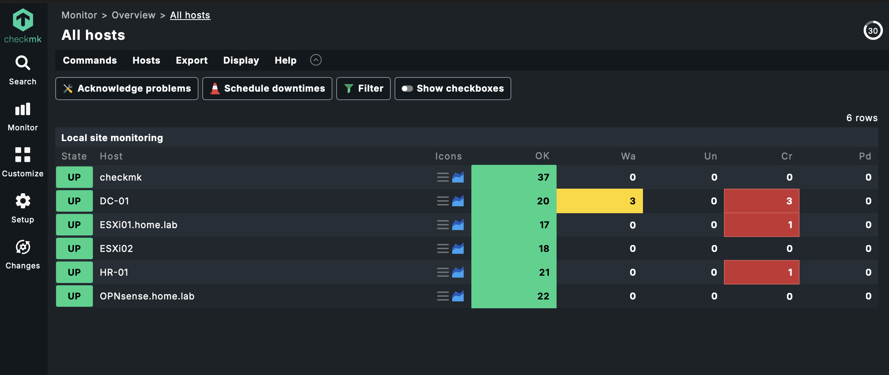

# 05. Monitoring & Operations

## Overview

This section documents the monitoring architecture implemented within the HomeLab environment.

Monitoring is provided through Checkmk and is used to collect system health, service availability, and infrastructure status information across all managed systems.

---

## Table of Contents

- [Monitoring Dashboard](#monitoring-dashboard)
- [Monitored Systems](#monitored-systems)
- [Monitoring Features](#monitoring-features)
- [Monitoring Benefits](#monitoring-benefits)

## Monitoring Dashboard

<i>Figure: Centralized infrastructure monitoring using Checkmk</i>

---

## Monitored Systems

| System | Monitoring |
|----------|----------|
| OPNsense Firewall | Availability, Interfaces, Services |
| ESXi Host 01 | Host Health, Resources |
| ESXi Host 02 | Host Health, Resources |
| DC01 | Windows Services, CPU, Memory, Disk |
| HR01 | Client Availability |
| MON01 | Monitoring Server Health |

---

## Monitoring Features

The monitoring environment provides visibility into:

- Host Availability
- CPU Utilization
- Memory Usage
- Disk Capacity
- Network Interfaces
- Windows Services
- ESXi Host Health
- Firewall Availability
---

## Monitoring Benefits

The monitoring solution provides:

- Infrastructure Visibility
- Service Availability Monitoring
- Resource Utilization Monitoring
- Early Issue Detection
- Centralized Operational Monitoring
